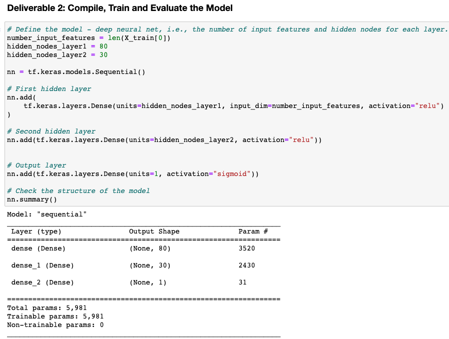
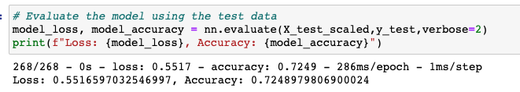
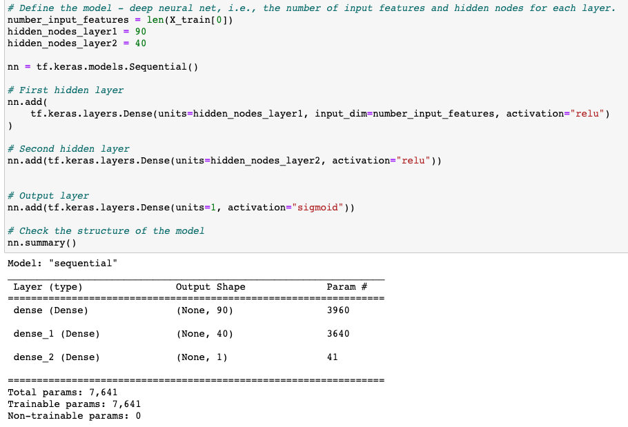
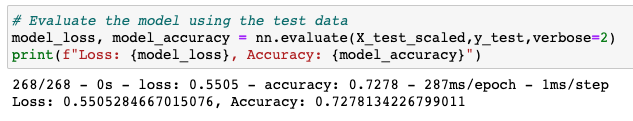
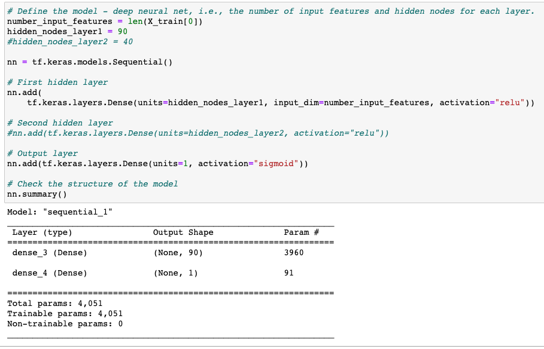
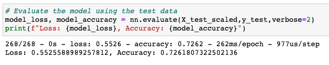
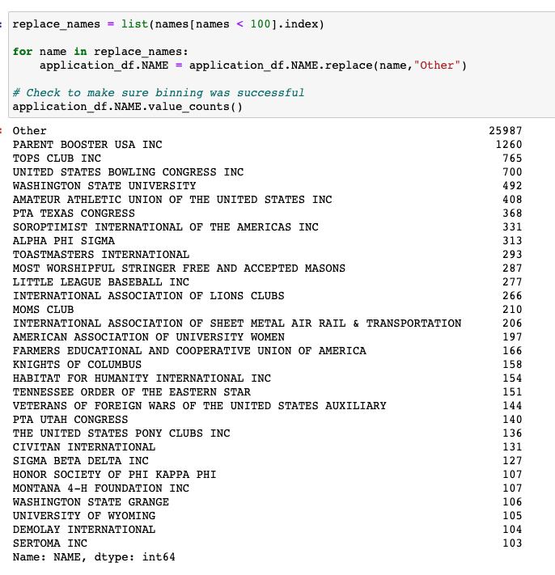
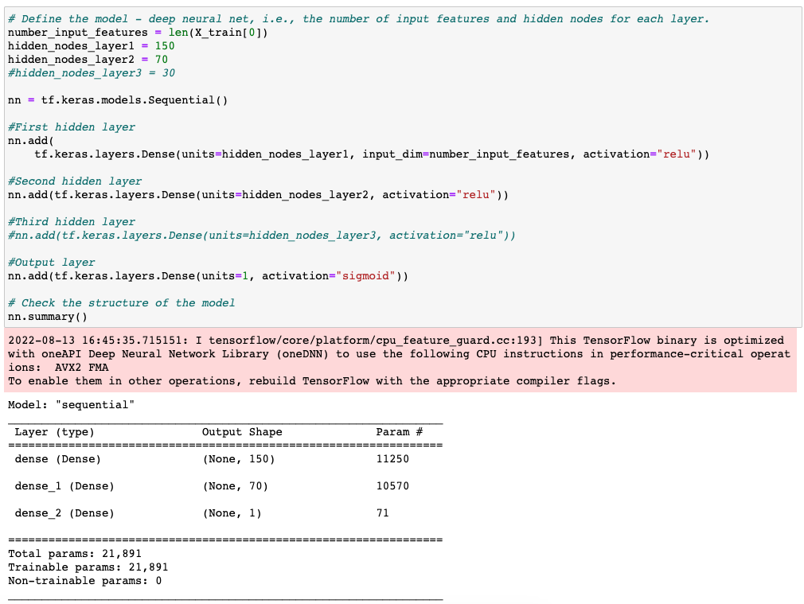
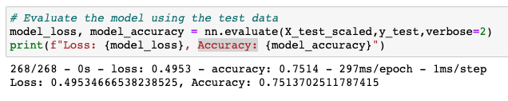

# Neural_Network_Charity_Analysis

## Overview of the analysis: 

- In this project, we used Machine Learning Neural Networks to evaluate the success of a charity campaign. Our data was a list of organizations' names with related information. Each organization was asked for a donation of a different amount. We processed the data first by deleting useless columns, like NAME and EIN., of the organizations. Then, we used the Python TensorFlow library to evaluate all types of input data to train the deep learning model. After following the default steps to process and fit the data, we got a 72% correct rate in the testing data. Finally, We optimized and adjusted the code in three ways to achieve a 75.1% accuracy as our target goal.

## Results: 

## 1. Data Preprocessing
    - What variable(s) are considered the target(s) for your model?
    'IS_SUCCESSFUL' column

    - What variable(s) are considered to be the features for your model?
    Every other column except for the 'IS_SUCCESSFUL' column

    - What variable(s) are neither targets nor features, and should be removed from the input data?
    -Column 'EIN' and column 'NAME'

## 2. Compiling, Training, and Evaluating the Model
### How many neurons, layers, and activation functions did you select for your neural network model, and why?
    
When we dropped the 'EIN' and 'Name' columns and used OneHotEncoder to process the data, we had 43 features for each item. So we chose two times of features for the unit number. Therefore, as the screenshot shows below, the input layer has 80 units, and the hidden layer has 30 units.

### Were you able to achieve the target model performance?

- The accuracy of the default model was around 72%, which did not hit the target of 75%

### What steps did you take to try and increase model performance?
- We tried several attempts to increase the accuracy number. The first two attempts were focused on increasing or decreasing the neurons and layers of the machine learning model. Although we did see an increase in the accuracy number of the final testing data, the amount is tiny.

- In the 3rd attempt, we went back to the data processing step. We first deleted one more column, 'STATUS', because only 5 out of 30000+ in 'STATUS' is '0'. The rest are all '1'. But this change didn't increase the accuracy of our test results. It, on the contrary, decreased the accuracy. 

- Therefore, we changed our mind from deleting more columns to adding back columns to add more parameters. This time, we added back the 'NAME' column and reduced the unique values of 'NAME' from 19,568 to 31. This increased our total input parameters from 43 to 74, which correspondingly increased the unit number in each layer of the machine learning model. 

### Attempt 1: 
#### Increase units in each layer

#### Result:

### Attempt 2: 
#### Delete the 2nd Hidden layer and keep only one hidden layer

#### Result:

### Attempt 3:
#### Focus on the Data processing step and put back the 'NAME' column

#### Edit the deep learning model

#### Result

## Summary: 

- The final attempt successfully increased the testing accuracy to 75.1%, which hit our target of over 75% accuracy rate. However, the data processing progress was very manual and time-consuming. We bucketed the number of unique values for the categorical column 'NAME' several times, from 10 to 30, and we got over 75% accuracy when we tried 30 unique values in 'NAME' and replaced everything else with "Others."

- Considering the steps and the amount of manual work to increase the accuracy in this deep learning model, we recommend that some other models might also be able to provide a similar accuracy with fewer steps and data processing, like random forest and other decision tree models.

